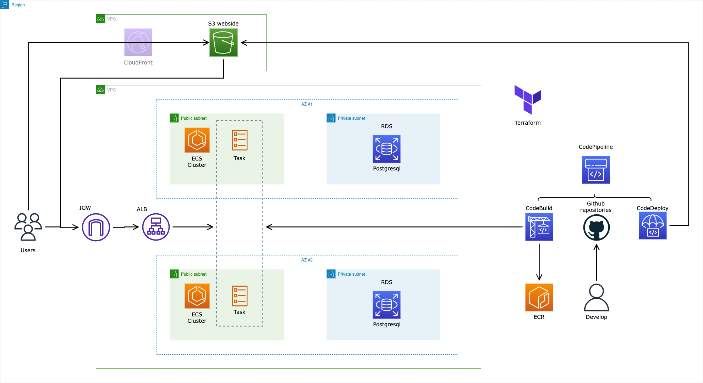

<p align="center"><h1 align="center">
  Trail Planner - Infrastructure
</h1>

<p align="center">
  A very simple HTTP API to build fast prototypes
</p>

[](https://github.com/MasterCloudApps-Projects/trail-planner/issues)

[](https://github.com/MasterCloudApps-Projects/trail-planner/network)
[](https://github.com/MasterCloudApps-Projects/trail-planner/stargazers)

# Introducción

En este repositorio se encuentra la infraestructura de la aplicacion web TrailPlanner desarrollada para el Trabajo de 
Fin de Master del master de Desarrollo de Aplicaciones Cloud. 
Toda la arquitectura esta basada en el uso de servicios de AWS como base para poder ejecutar la aplicación web y todos
los componentes necesarios para un despliegue e integración continua. Para orquestar todos los servicios de AWS se ha 
usado terraform.

## Repositorio

El repositorio sigue una estructura de modulos de terraform organizados en el fichero [main.tf](main.tf). Este fichero
gestiona las variables de entrada y salida de los diferentes modulos interconectando lo neceario.
Por eso cada modulo dispone de un fichero variable.tf que dispone de las variables de entrada al modulo pasadas desde 
el main.tf y otro output.tf que se encarga de devolver las variables de salida al main.tf.

Si el modulo solo compone un servicio y es descriptivo por si solo se tendr'a un fichero main.tf, en el caso contrario 
se dispondra de un fichero de terraform por cada servicio necesario.

En el fichero [provider.tf](provider.tf) se proporciona que version de terraform se usa y los provider con su verion. \En el caso de este repositorio solo usamos el provider de AWS.

En el caso del fichero [variables.tf](variables.tf) y [terraform.tfvars](terraform.tfvars), especifican las variables que se usan de forma global en la infraestructura y cuales son especificadas por defecto.
Aquellas que no esten por defecto en [terraform.tfvars](terraform.tfvars) deben ser dadas en el despliegue.

## Diagramas



La arquitectura que se visualiza enel diagrama se separa en tres partes bien diferenciadas, con un uso de varios 
tipos servicios de AWS independientes. 

1. Backend: En este apartado se encuentran los servicios necesarios para que el backend pueda funcionar de forma 
correcta, distribuida ante altas cargas y con replicas ante caidas parciales del servicio.
    - [ECS Fargate](ecs/ecs-fargate.tf): El core del código se depliega en un contenedor de docker en ECS fargate. 
    En este fichero de .tf se encuentra toda la definicion necesaria del ecs, con apartados de memoria, vcpu, variables 
    de entorno usadas dentro de la aplicacion, logs y role de iam necesario. Tambien se le asigna la configuracion 
    para conectar ECS a los servicios de redes como vpc, subnets y load balancer.
    - [ECR](ecs/ecr.tf): Solo contiene la creacion del repositorio para llamarlo en otros componentes.
    - [RDS](rds/main.tf): Se dispone de la defincion de la instancia de base de datos y toda su configuracion: engine, 
    version, puerto, clase de instancia, nombre de la base de datos... Ademas se integra la base de datos en ambas subnets.
2. Frontend: Seccion con todos los servicios especificos para el frontal de la aplicacion web. Soportada en una web 
estatica en bucket de s3. Ademas encontramos otros servicios especificos de redes como cloudfront.
    - [Bucket](website/bucket.tf): Encontraremos la creación del bucket con todos los permisos publicos que se necesitan para que la web estatica
    se pueda visualizar de forma abierta. Añadiendo los ACLs, CORS y iam policies.
    - [CloudFront](website/cloudfront.tf): la creacion del cloudfront con todas propiedades asocidas a la web que cachea.
    Tambien dispone de las peticiones http cachea, en que orden y con que ficheros (*.css, *.js, *.png...)
3. Despliegue automatico: Carpeta donde están los servicios que vigilan los repositorios en github tanto de backend como
frontend para en cuanto haya un cambio se activen un conjunto de servicios para poder desplegar de forma automatica la 
aplicacion con la ultima version.
    - [CodeBuild](codepipelines/codebuilds.tf): Creacion de los codebuild para backend y frontend. Para cada uno si es 
    necesario se crea uno de pre_build y otro de build soportado a partir de los ficheros yml de buildspec. 
    Dentro de cada build se se incorpora todas propiedades al servicio que necesita, como configuracion de la vpc o 
    variables de entorno que necesita (imagen usada, tipo de maquina...)
    - [Templates](codepipelines/templates): Carpeta que contiene todos los fichero de buildspec llamados en la creacion 
    del buildcode. En el caso del pre_build se prepara la informacion previa necesaria y le ejecutan los test disponibles.
    Para el build se hace el despliegue del codigo final dependiendo del servicio destino.
    - [Codepipelines](codepipelines/codepipelines.tf): prepara los orquestadores del backend y frontend relativos al 
    despliegue del codigo. Conecta el arranque con el repositorio de github y despues ejecuta en orden los diferentes 
    build y deploys que sean necesarios. 
    - [Roles](codepipelines/roles.tf): Todos los roles con sus policies de IAM para el codepipeline, codebuild y codedeploy.
4. Network: Contiene toda los los servicios de redes que se usan en el resto servicios y para poder completar las 
conexiones internas y externas hacia el usuario final. 
   - [ALB](network/alb.tf): Creacion del Aplicacion load Balancer con su target para especificar entre que IPs y puertos 
   escucha y administra la carga.
   - [Security Group](network/security-groups.tf): Centraliza la creacion de todos los security groups usados en el resto de servicios.
   - [VPCs, Subnets & Gateway](network/vpc.tf): Creacion de la vpc principal, las subnets privada y publica y el gateway 
   con la tablas de ruta necesarias para poder redirigir a internet. 

## Requerimientos

* Debe tener instalado [Terraform](https://www.terraform.io/) en tu ordenador.
* Debe tener una cuenta de [AWS (Amazon Web Services)](http://aws.amazon.com/).
* Se utiliza el proveedor AWS de Terraform que interactúa con los recursos admitidos por AWS a través de sus API.
* Este código ha sido escrita con la versión mínima Terraform 1.2.8.

## Importante

- **Este proyecto no está dentro de la Suscripción gratuita de AWS. Por lo tanto, es posible que si inicia todos los servicios, este
tendrá un coste elevado para usted.**
- **Por seguridad, como indica AWS se recomienda que utilice usuarios de IAM en lugar de la cuenta raíz para el acceso a AWS.**

## Uso de código

* Configure sus claves de acceso de AWS: la configuración de sus credenciales para que Terraform las use se puede hacer de varias maneras, pero estos son los enfoques recomendados:

  * El archivo predeterminado de credenciales: configure las credenciales en el archivo de perfil de credenciales de AWS en su sistema local, ubicado en:

    `~/.aws/credentials` en Linux, macOS, o Unix

    `C:\Users\USERNAME\.aws\credentials` en Windows

    Este archivo debe contener líneas en el siguiente formato:

    ```bash
    [default]
    aws_access_key_id = <your_access_key_id>
    aws_secret_access_key = <your_secret_access_key>
    ```
    Sustituya los valores de sus propias credenciales de AWS por los valores `<your_access_key_id>` y `<your_secret_access_key>`.

  * Variables de entorno `AWS_ACCESS_KEY_ID` y `AWS_SECRET_ACCESS_KEY`
  
    Añade las variables de entorno `AWS_ACCESS_KEY_ID` y `AWS_SECRET_ACCESS_KEY`.

    Para configurar estas variables en Linux, macOS o Unix, use `export`:

    ```bash
    export AWS_ACCESS_KEY_ID=<your_access_key_id>
    export AWS_SECRET_ACCESS_KEY=<your_secret_access_key>
    ```

    Para configurar estas variables en Windows, use `set`:

    ```bash
    set AWS_ACCESS_KEY_ID=<your_access_key_id>
    set AWS_SECRET_ACCESS_KEY=<your_secret_access_key>
    ```

## Despliegue

* Initialize working directory: The first command that should be run after writing a new Terraform configuration is the 
`terraform init` command in order to initialize a working directory containing Terraform configuration files. It is safe
to run this command multiple times.
* 
* Inicializar el directorio de trabajo: el primer comando que debe ejecutarse después de escribir una nueva configuración de Terraform es el
comando `terraform init` para inicializar un directorio de trabajo que contiene archivos de configuración de Terraform. No hay problema si este comando se
ejecuta varias veces.

  ```bash
  terraform init
  ```

* Configura los valores de configuración:

  Debes modificar las variables por defecto:

    ```bash
    aws_region=<aws_region>
    aws_profile=<aws_profile>
    image_repo_name=<image_repo_name>
    source_backend_repo_name=<image_repo_name>
    source_frontend_repo_name=<source_backend_repo_name>
    source_repo_branch=<source_repo_branch>
    source_repo_owner=<source_repo_owner>
    stack=<stack>
    ```

  Puede modificar el valor de las variables de varias maneras. Por ejemplo, con `aws_region`:

  * Cargando las variables desde las flags en la linea de comandos.

    Ejecute los comandos de Terraform de esta manera:

    ```bash
    terraform plan -var 'aws_region=<aws_region>'
    ```

    ```bash
    terraform apply -var 'aws_region=<aws_region>'
    ```

  * Carga de variables desde un archivo.

    Cuando se ejecute Terraform, buscará un archivo llamado `terraform.tfvars`. Puede llenar este archivo con los
    valores que se cargarán cuando se ejecute Terraform. Un ejemplo del contenido del archivo `terraform.tfvars`:

    ```bash
    aws_region = "<aws_region>"
    ```

  * Cargando variables desde variables de entorno.

    Terraform también analizará cualquier variable de entorno que tenga el prefijo `TF_VAR`. Puedes crear un
    variable de entorno como `TF_VAR_aws_region`:

    ```bash
    TF_VAR_aws_region=<aws_region>
    ```

  * Variables por defecto.

    Cambie el valor del atributo `default` de la variable de entrada `aws_region` en el archivo `vars.tf`.

    ```hcl
    variable "aws_region" {
      description = "The name of aws region"
      default = "<aws_region>"
    }
    ```

* Valida los cambios.

  Lanza el comando:

  ```bash
  terraform plan
  ```

* Despliega los cambios.

  Lanza el comando:

  ```bash
  terraform apply -var db_password=<db_password> -var source_repo_github_token=<source_repo_github_token> 
  ```

* Obten la planificación de despliegue.

  Cuando se complete el comando `terraform apply`, use la consola de AWS, debería ver todos los servicios creados y las canalizaciones en ejecución.

## Limpieza

 Cuando hayas teminado y se quiera borra los servicios, arranca el comando:

  ```bash
  terraform destroy
  ```
